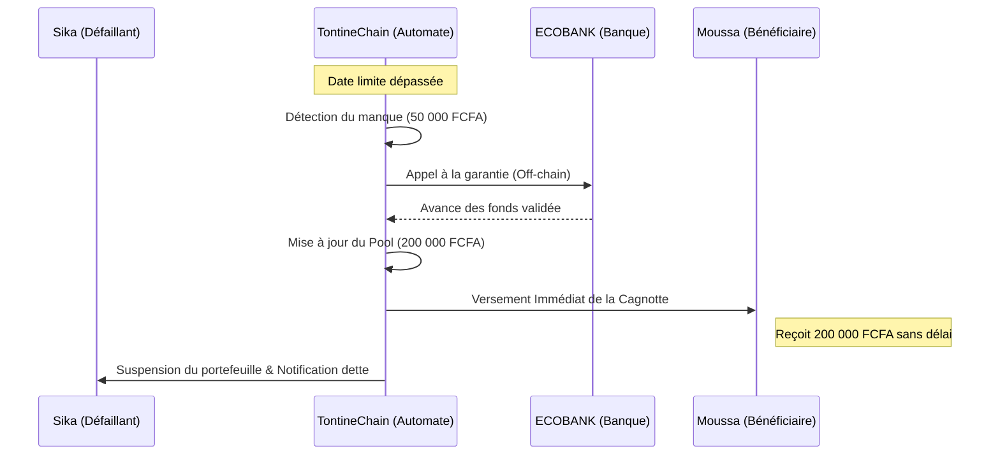

# TontineChain : Scénario de Démonstration (Garantie Bancaire)

Ce document décrit le fonctionnement technique et opérationnel du mécanisme de **relais bancaire automatique** en cas de défaut de paiement d'un membre.

## 1. Les Acteurs Simulés

| Acteur | Rôle | État Initial |
| :--- | :--- | :--- |
| **Ama** | Organisatrice | Admin du groupe "Tontine Solidarité" |
| **Koffi** | Membre Ponctuel | Solde suffisant, paie toujours à temps |
| **Sika** | **Membre Défaillant** | Oubli ou manque de liquidité à l'échéance |
| **Moussa** | **Bénéficiaire** | Doit recevoir la cagnotte lors de ce tour |
| **ECOBANK** | Banque Partenaire | Garant institutionnel du groupe |

---

## 2. Le Flux de Démonstration

### Étape 1 : Création & Adhésion (Vérification de Garantie)
- **Action** : Ama crée un groupe de 4 membres avec une mise de **50 000 FCFA** par mois.
- **Sécurité** : Chaque membre (Koffi, Sika, Moussa) doit fournir son **numéro de compte bancaire partenaire** pour rejoindre le groupe.
- **Vérification** : Ama valide les garanties dans l'interface Admin. Le smart contract enregistre les preuves.

### Étape 2 : Le Cycle de Cotisation
- Le tour actuel est pour **Moussa**. La cagnotte attendue est de **200 000 FCFA**.
- **Koffi** paie ses 50 000 FCFA via l'application.
- **Ama** paie ses 50 000 FCFA.
- **Moussa** (le bénéficiaire) paie également sa part de 50 000 FCFA.
- **État du Pool** : 150 000 / 200 000 FCFA.

### Étape 3 : L'Incident (Date Limite Dépassée)
- La date limite de cotisation (ex: le 5 du mois à 23h59) arrive.
- **Sika** n'a pas effectué son virement.
- **Statut de Sika** : Son compte est marqué comme `LATE` (en retard) par le système.

---

## 3. Le Relais Bancaire (Démonstration du Flux de Secours)

C'est ici que l'automatisation de TontineChain intervient pour garantir la fluidité.

### Détail Technique :
1. **Déclenchement** : La fonction `rpc_tontine_automation` détecte que `v_paid < v_total` après la deadline.
2. **Compensation** : La banque (via son interface partenaire) complète virtuellement la cagnotte.
3. **Paiement Garanti** : Moussa reçoit ses **200 000 FCFA** instantanément. Pour lui, l'expérience est transparente et sans stress.

---

## 4. Gestion Post-Incident

| Élément | Impact |
| :--- | :--- |
| **Score de Sika** | Chute drastique (ex: -150 points). |
| **Portefeuille Sika** | Statut `SUSPENDED`. Sika ne peut plus effectuer de retraits tant que la dette n'est pas remboursée à la banque. |
| **Recouvrement** | La banque partenaire se charge de prélever les 50 000 FCFA sur le compte bancaire de Sika (garantie réelle). |
| **Confiance** | Le groupe continue son cycle sans interruption, la solidarité est préservée par l'institution. |

---

## 5. Conclusion de la Démonstration

Le modèle **TontineChain x Banque Partenaire** transforme la tontine d'un système de "bonne foi" en un système de **"certitude financière"**. 

- **Le membre** n'a plus peur de ne pas être payé.
- **La banque** gagne des clients engagés et sécurisés.
- **L'application** assure la transparence totale des flux.
